# ForgeMind AI — System Architecture

**Project:** ForgeMind AI
**Subtitle:** Manufacturing Knowledge & Operations Intelligence Assistant
**Architecture Version:** 1.0
**Status:** Development Baseline
**Last Updated:** 2026-09-30

---

# 1. Project Identity

## 1.1 Name

**ForgeMind AI**

## 1.2 Subtitle

**Manufacturing Knowledge & Operations Intelligence Assistant**

## 1.3 One-Line Description

> ForgeMind AI is a local-first AI assistant that connects manufacturing documentation and operational data through RAG, semantic search, PostgreSQL, and MCP-powered tools.

## 1.4 Project Purpose

ForgeMind AI is an AI Engineering portfolio project designed to demonstrate the design and implementation of an end-to-end AI application.

The system combines:

* Large Language Models
* local LLM inference
* Retrieval-Augmented Generation
* semantic search
* vector databases
* PostgreSQL
* controlled data access
* MCP tools
* prompt engineering
* AI evaluation
* automated testing
* observability

The project uses synthetic manufacturing data and does not depend on proprietary company information.

---

# 2. Architecture Goals

The architecture is designed around the following goals:

1. Keep the system understandable.
2. Separate AI reasoning from data access.
3. Separate structured and unstructured retrieval.
4. Make AI components replaceable.
5. Make evaluation reproducible.
6. Make failures observable.
7. Prevent unnecessary access to underlying systems.
8. Allow the system to evolve without premature complexity.

The project intentionally uses a **modular monolith** rather than microservices.

---

# 3. Architectural Principles

## 3.1 LLM Is Not the Source of Truth

The LLM generates responses but does not own authoritative data.

Sources of truth are:

```text
Documentation
      ↓
Vector Store

Operational Data
      ↓
PostgreSQL
```

---

## 3.2 Structured and Unstructured Data Are Different

Documentation questions use the RAG pipeline.

Operational questions use structured database access.

The system should not put all available information into a vector database.

---

## 3.3 Simple Architecture First

The first implementation should use explicit routing and controlled services.

Advanced agent frameworks are not required unless the architecture demonstrates a real need for them.

---

## 3.4 Measure Before Optimizing

Any optimization should be supported by an experiment.

```text
Hypothesis
    ↓
Experiment
    ↓
Metric
    ↓
Result
    ↓
Conclusion
```

---

## 3.5 AI Components Must Be Evaluatable

Every important AI component should have measurable behavior.

Examples:

```text
Retriever
→ Precision@K
→ Recall@K
→ MRR

Generator
→ Correctness
→ Faithfulness
→ Context relevance

System
→ Latency
→ Error rate
```

---

# 4. System Context

At the highest level:

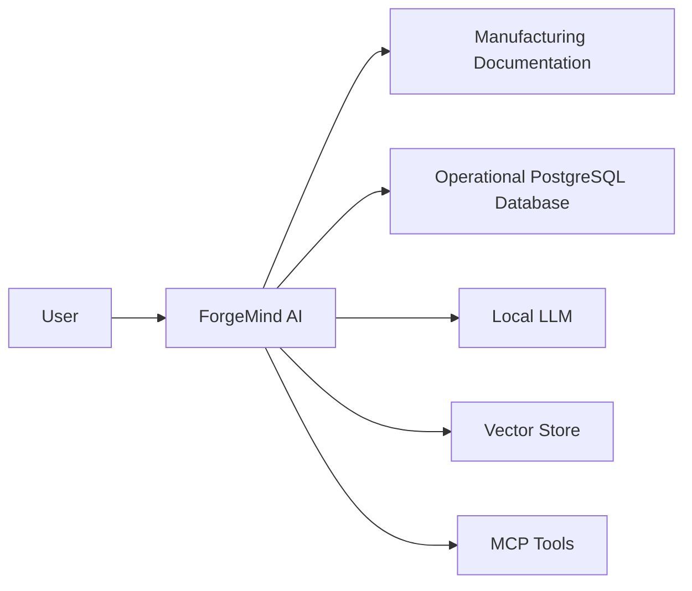

ForgeMind AI acts as the orchestration layer between the user and multiple information sources.

---

# 5. High-Level Architecture

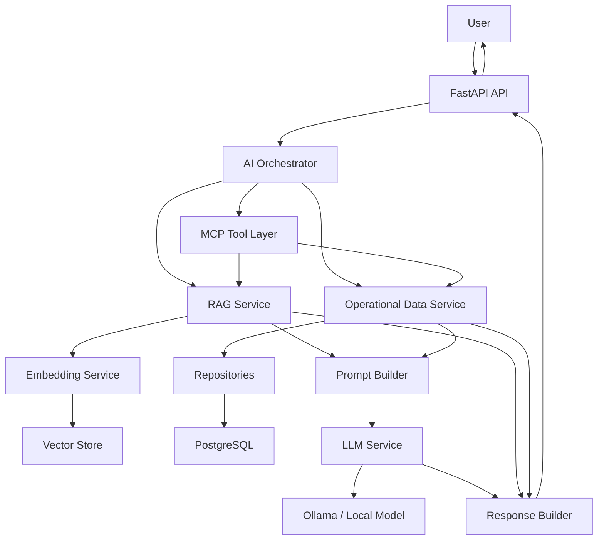

---

# 6. Main Components

## 6.1 FastAPI API

The API is the external entry point of ForgeMind AI.

Responsibilities:

* HTTP request handling
* request validation
* response serialization
* API-level error handling
* OpenAPI documentation

The API should not contain business or AI logic.

---

# 7. AI Orchestrator

The AI Orchestrator coordinates the request lifecycle.

Responsibilities:

1. Receive normalized user query.
2. Determine query intent.
3. Select required capabilities.
4. Execute retrieval/tool operations.
5. Construct evidence/context.
6. Invoke the LLM.
7. Build final response.

Conceptual flow:

```text
User Query
    ↓
Intent
    ↓
Capability Selection
    ↓
Evidence Retrieval
    ↓
Context Construction
    ↓
LLM
    ↓
Response
```

---

# 8. Query Routing

The initial routing categories are:

```text
DOCUMENTATION
DATABASE
MIXED
UNKNOWN
```

Example:

```text
"What does E1023 mean?"
        ↓
DOCUMENTATION
        ↓
RAG
```

```text
"How many work orders failed this week?"
        ↓
DATABASE
        ↓
PostgreSQL
```

```text
"How many E1023 errors occurred this month and
what should operators check?"
        ↓
MIXED
        ↓
RAG + PostgreSQL
```

The initial implementation should favor deterministic and understandable routing.

---

# 9. RAG Architecture

## 9.1 Offline Ingestion

Document ingestion occurs separately from normal user requests.

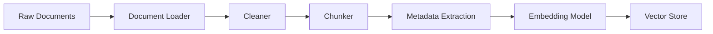

This prevents documents from being reprocessed on every user query.

---

## 9.2 Runtime Retrieval

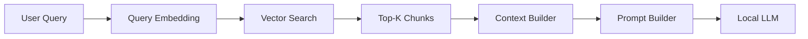

---

# 10. Vector Store Abstraction

The application should not be tightly coupled to one vector database.

Conceptual interface:

```text
VectorStore
├── add_documents()
├── search()
├── delete()
└── health_check()
```

Initial implementation:

```text
VectorStore
     ↓
ChromaVectorStore
```

Possible future implementation:

```text
VectorStore
     ├── ChromaVectorStore
     ├── QdrantVectorStore
     └── PgVectorStore
```

The actual implementation will be selected based on experiment and requirements.

---

# 11. Document Chunk Model

Each indexed chunk should preserve metadata.

Conceptual model:

```text
DocumentChunk
├── chunk_id
├── document_id
├── document_name
├── section
├── content
└── metadata
```

Example:

```text
chunk_id:
toolpath-processing-003

document:
toolpath_processing.md

section:
Error Recovery

content:
Before restarting...
```

This metadata enables source attribution and future filtering.

---

# 12. Embedding Architecture

The embedding service abstracts embedding generation.

```text
RAG Service
     ↓
Embedding Service
     ↓
Embedding Model
```

The same embedding space must be used consistently between:

* indexed documents
* user queries

Embedding model selection will be based on:

* retrieval quality
* local resource requirements
* inference speed
* language support
* reproducibility

---

# 13. Operational Data Architecture

Structured operational data follows a different path.

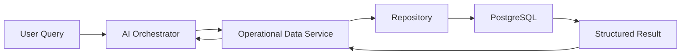

The database is treated as the source of truth for operational information.

---

# 14. Database Architecture

Initial entities:

```text
machines
work_orders
production_events
error_logs
quality_checks
maintenance_records
```

Conceptual relationships:

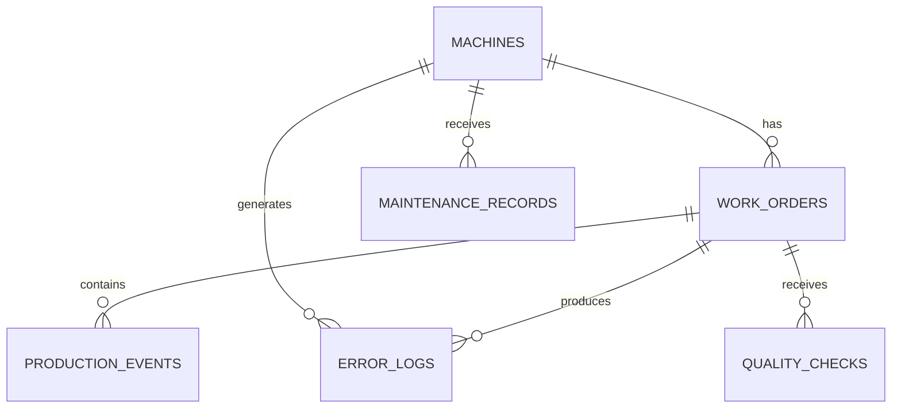

Detailed schema is maintained separately in:

```text
docs/database.md
```

---

# 15. Repository Layer

Database access should be isolated behind repositories.

Example:

```text
OperationalDataService
        ↓
WorkOrderRepository
        ↓
PostgreSQL
```

Repositories handle data access.

Services handle application/business logic.

This allows:

* easier unit testing
* controlled database access
* separation of concerns
* easier database implementation changes

---

# 16. MCP Architecture

MCP provides an interface through which AI systems can access controlled capabilities.

Conceptually:

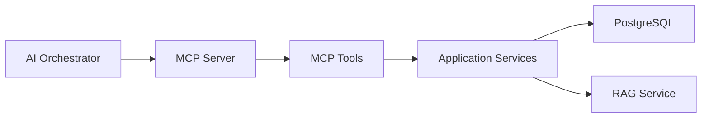

The MCP layer should not duplicate business logic.

For example:

```text
MCP Tool
    ↓
get_failed_work_orders()
    ↓
OperationalDataService
    ↓
WorkOrderRepository
    ↓
PostgreSQL
```

---

# 17. MCP Tool Design

Tools should be narrowly scoped.

Example:

```text
get_failed_work_orders
get_work_order
get_machine_status
get_production_summary
search_documentation
```

Avoid generic tools such as:

```text
execute_any_sql()
execute_shell_command()
read_any_file()
```

unless a future requirement explicitly justifies them and appropriate security controls exist.

---

# 18. LLM Architecture

The application should use an abstraction:

```text
LLMService
```

Initial implementation:

```text
LLMService
    ↓
Ollama
    ↓
Local Model
```

Potential future implementations:

```text
LLMService
    ├── Ollama
    ├── Local Transformers
    └── External API
```

The orchestrator should not depend directly on Ollama-specific implementation details.

---

# 19. Prompt Architecture

Prompts should be separated from business logic.

Conceptual flow:

```text
Retrieved Context
       +
Database Results
       +
User Query
       ↓
Prompt Builder
       ↓
System Instructions
       ↓
LLM
```

The prompt should contain rules such as:

* use available evidence
* do not invent operational data
* distinguish evidence from uncertainty
* identify sources
* state when evidence is insufficient

---

# 20. Response Architecture

The response should contain more than generated text.

Conceptual model:

```json
{
  "answer": "...",
  "intent": "DOCUMENTATION",
  "sources": [],
  "tools_used": [],
  "metadata": {}
}
```

For database queries:

```json
{
  "answer": "37 work orders failed this week.",
  "intent": "DATABASE",
  "sources": [],
  "tools_used": [
    "get_failed_work_orders"
  ]
}
```

For RAG:

```json
{
  "answer": "...",
  "intent": "DOCUMENTATION",
  "sources": [
    {
      "document": "toolpath_processing.md",
      "section": "Error Recovery"
    }
  ],
  "tools_used": []
}
```

The exact API schema will be defined during implementation.

---

# 21. End-to-End Request Flow — RAG

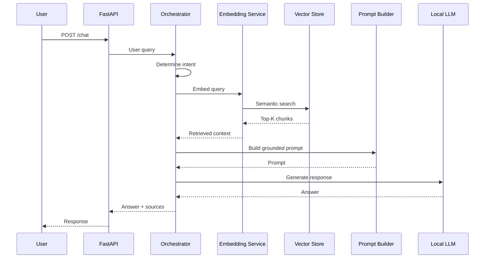

---

# 22. End-to-End Request Flow — Database

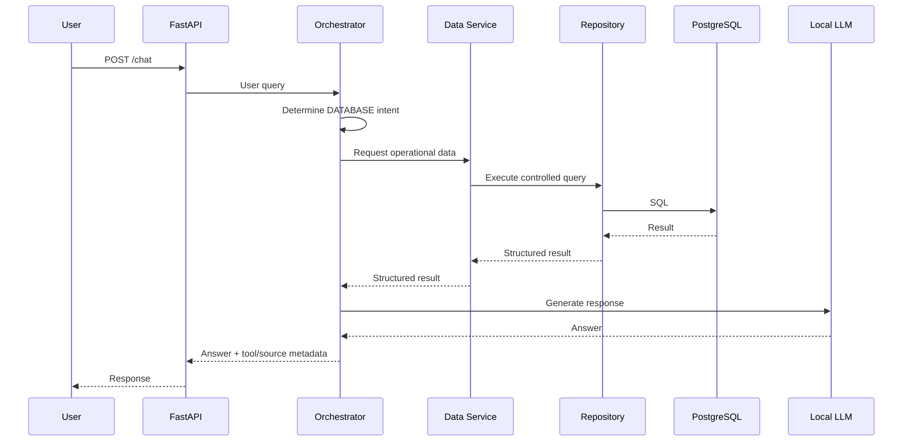

---

# 23. End-to-End Request Flow — Mixed Query

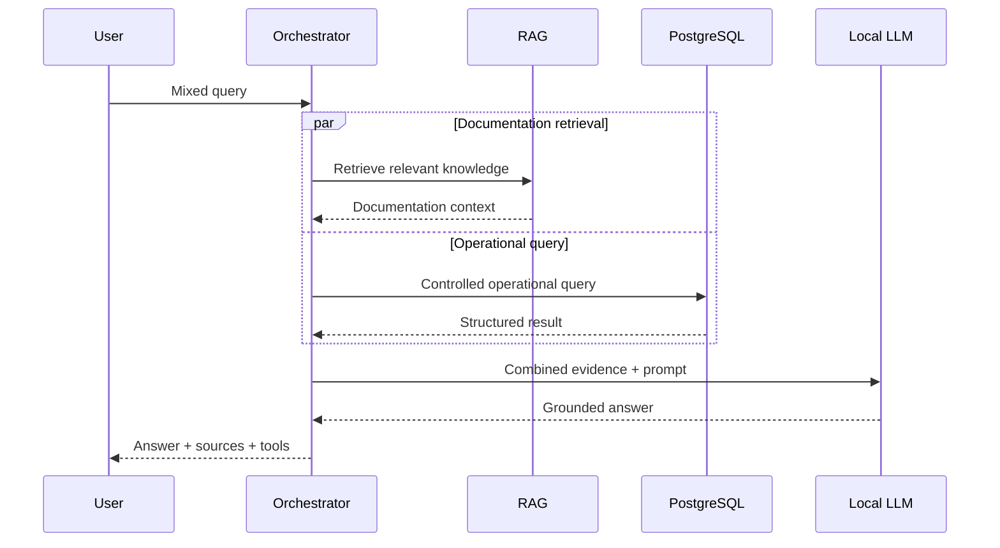

---

# 24. Error Architecture

The system must distinguish infrastructure failures from knowledge failures.

Examples:

```text
Vector Store unavailable
PostgreSQL unavailable
LLM unavailable
MCP unavailable
No relevant documents
Insufficient evidence
Invalid request
Timeout
```

These should be handled explicitly.

For example:

```text
No relevant document
        ↓
Knowledge limitation
        ↓
"I don't have enough information..."
```

versus:

```text
Vector DB unavailable
        ↓
Infrastructure failure
        ↓
"Knowledge service is temporarily unavailable."
```

---

# 25. Observability

The system should capture enough information to understand a request lifecycle.

Conceptual trace:

```text
Request ID
   │
   ├── Intent
   ├── Retrieval
   ├── Retrieved chunks
   ├── Tool calls
   ├── LLM call
   ├── Retrieval latency
   ├── Generation latency
   ├── Total latency
   └── Error
```

Sensitive information should not be logged unnecessarily.

---

# 26. Security Boundaries

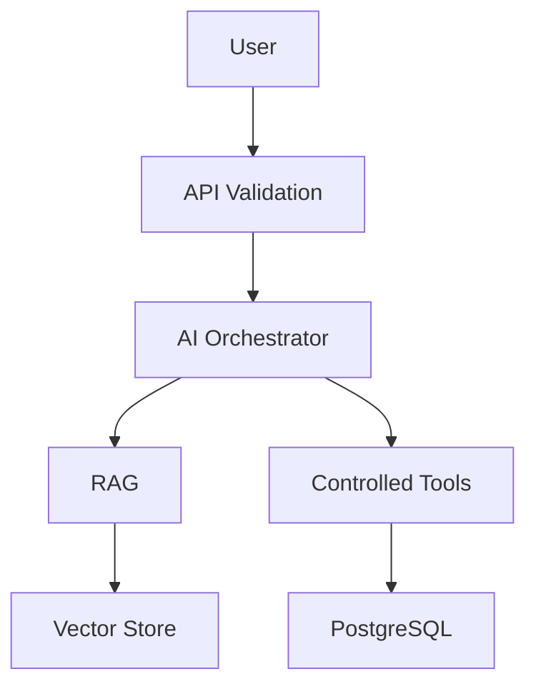

Users do not receive direct access to:

* PostgreSQL
* vector store
* filesystem
* local model runtime

---

# 27. Repository Architecture

The repository follows a modular-monolith structure.

```text
forgemind-ai/
│
├── README.md
├── LICENSE
├── .gitignore
├── .env.example
├── pyproject.toml
│
├── backend/
│   ├── app/
│   │   ├── __init__.py
│   │   ├── main.py
│   │   ├── config.py
│   │   ├── dependencies.py
│   │   │
│   │   ├── api/
│   │   │   ├── __init__.py
│   │   │   └── chat.py
│   │   │
│   │   ├── schemas/
│   │   │   ├── __init__.py
│   │   │   └── chat.py
│   │   │
│   │   ├── services/
│   │   │   ├── __init__.py
│   │   │   ├── orchestrator.py
│   │   │   ├── rag_service.py
│   │   │   ├── llm_service.py
│   │   │   ├── embedding_service.py
│   │   │   └── operational_data_service.py
│   │   │
│   │   ├── repositories/
│   │   │   ├── __init__.py
│   │   │   └── work_order_repository.py
│   │   │
│   │   ├── database/
│   │   │   ├── __init__.py
│   │   │   ├── connection.py
│   │   │   └── models.py
│   │   │
│   │   ├── rag/
│   │   │   ├── __init__.py
│   │   │   ├── loader.py
│   │   │   ├── cleaner.py
│   │   │   ├── chunker.py
│   │   │   ├── retriever.py
│   │   │   └── vector_store.py
│   │   │
│   │   ├── embeddings/
│   │   │   ├── __init__.py
│   │   │   └── provider.py
│   │   │
│   │   ├── llm/
│   │   │   ├── __init__.py
│   │   │   └── ollama.py
│   │   │
│   │   ├── prompts/
│   │   │   ├── __init__.py
│   │   │   └── templates.py
│   │   │
│   │   └── mcp/
│   │       ├── __init__.py
│   │       └── server.py
│   │
│   └── tests/
│       ├── unit/
│       │   ├── test_chunker.py
│       │   ├── test_retriever.py
│       │   ├── test_prompts.py
│       │   └── test_services.py
│       │
│       └── integration/
│           ├── test_api.py
│           ├── test_database.py
│           ├── test_rag.py
│           └── test_mcp.py
│
├── data/
│   ├── documents/
│   │   ├── machine_manual.md
│   │   ├── toolpath_processing.md
│   │   ├── troubleshooting.md
│   │   ├── quality_control.md
│   │   ├── production_workflow.md
│   │   ├── maintenance_procedure.md
│   │   ├── error_codes.md
│   │   └── safety_procedure.md
│   │
│   ├── synthetic/
│   │   ├── machines.csv
│   │   ├── work_orders.csv
│   │   ├── production_events.csv
│   │   ├── error_logs.csv
│   │   ├── quality_checks.csv
│   │   └── maintenance_records.csv
│   │
│   └── evaluation/
│       └── questions.jsonl
│
├── scripts/
│   ├── ingest_documents.py
│   ├── seed_database.py
│   └── evaluate.py
│
├── experiments/
│   ├── README.md
│   └── results/
│
├── notebooks/
│   └── exploratory/
│
├── docs/
│   ├── requirements.md
│   ├── architecture.md
│   ├── database.md
│   ├── rag.md
│   ├── prompt-engineering.md
│   ├── mcp.md
│   ├── evaluation.md
│   ├── testing.md
│   ├── deployment.md
│   │
│   └── decisions/
│       ├── ADR-001-modular-monolith.md
│       ├── ADR-002-structured-vs-unstructured-retrieval.md
│       ├── ADR-003-local-llm.md
│       ├── ADR-004-vector-store.md
│       └── ADR-005-mcp-integration.md
│
└── frontend/
    └── README.md
```

---

# 28. Folder Responsibilities

## `backend/app/api/`

HTTP/API boundary.

Tidak berisi AI logic.

---

## `backend/app/services/`

Application/business logic.

Contoh:

```text
orchestrator.py
rag_service.py
operational_data_service.py
```

---

## `backend/app/repositories/`

Database access.

---

## `backend/app/database/`

Database configuration and ORM models.

---

## `backend/app/rag/`

Core RAG mechanics:

* loading
* cleaning
* chunking
* retrieval
* vector-store interface

---

## `backend/app/embeddings/`

Embedding provider abstraction.

---

## `backend/app/llm/`

LLM provider abstraction/implementation.

---

## `backend/app/prompts/`

Prompt templates and prompt versions.

---

## `backend/app/mcp/`

MCP server and tool exposure.

---

## `data/`

Project datasets.

Data must be synthetic/public.

---

## `scripts/`

CLI/offline workflows.

Examples:

```text
ingest_documents.py
seed_database.py
evaluate.py
```

---

## `experiments/`

Experiment records and results.

This is important because AI engineering work should show **how decisions were reached**, not only final code.

---

## `docs/`

Engineering documentation.

---

## `frontend/`

Optional user interface.

Frontend is intentionally isolated from backend so the AI system remains functional without it.

---

# 29. Dependency Direction

The application should generally follow:

```text
API
 ↓
Services
 ↓
Repositories / AI Components
 ↓
Infrastructure
```

Avoid reverse dependencies such as:

```text
Repository → API
Database → Service
LLM → FastAPI Controller
```

The goal is to keep infrastructure replaceable.

---

# 30. Dependency Boundaries

Important abstractions:

```text
LLMService
EmbeddingProvider
VectorStore
Repository
```

Conceptually:

```text
Orchestrator
    │
    ├── LLMService
    ├── EmbeddingProvider
    ├── VectorStore
    └── OperationalDataService
```

This allows implementation changes without rewriting orchestration logic.

---

# 31. Deployment Architecture

The first development environment is local.

```text
Developer Machine
│
├── FastAPI
├── PostgreSQL
├── Vector Store
└── Ollama
```

Docker is optional during the initial implementation.

Once the local architecture is stable, Docker can package the system.

Potential later architecture:

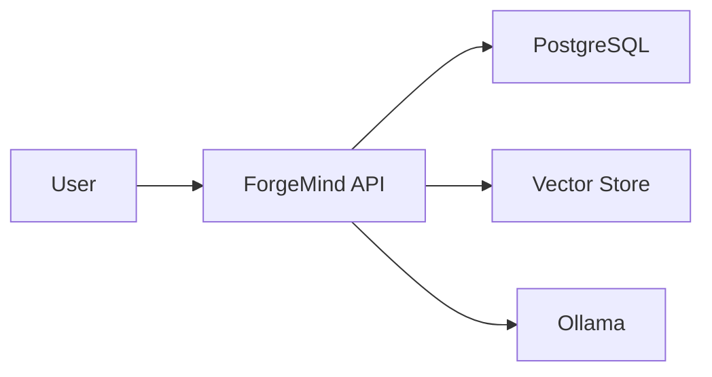

---

# 32. Architecture Trade-offs

## Modular Monolith vs Microservices

### Selected

Modular monolith.

### Reason

The project is primarily intended to demonstrate AI engineering fundamentals.

Microservices would add deployment and networking complexity without improving the core learning objective.

---

## Local LLM vs API Model

### Selected initially

Local LLM.

### Reason

The project explicitly targets understanding local inference, resource constraints, latency, and model configuration.

External APIs may be used later for comparison.

---

## RAG vs Fine-Tuning

### Selected initially

RAG.

### Reason

The primary problem involves retrieving changing domain knowledge.

Fine-tuning will be evaluated later as an experiment rather than assumed to be the solution.

---

## Explicit Routing vs Agent Framework

### Selected initially

Explicit/simple routing.

### Reason

It is easier to understand, test, debug, and evaluate.

Agent frameworks may be introduced later if complexity justifies them.

---

# 33. Architecture Evolution

The intended evolution is:

```text
Phase 1
Simple FastAPI
      ↓
Phase 2
RAG + Local LLM
      ↓
Phase 3
PostgreSQL integration
      ↓
Phase 4
MCP tools
      ↓
Phase 5
Evaluation
      ↓
Phase 6
Retrieval optimization
      ↓
Phase 7
Fine-tuning experiments
      ↓
Phase 8
Deployment / UI
```

Architecture should evolve based on demonstrated requirements.

---

# 34. Figma Relationship

Figma is considered a representation of the product experience, not the source of technical truth.

The Figma design should eventually represent:

### User Experience

```text
Chat
 ↓
Answer
 ↓
Sources
```

### AI Transparency

```text
Intent
 ↓
Retrieval / Tool
 ↓
Evidence
 ↓
Answer
```

### Portfolio Demo

```text
User Query
 ↓
AI Routing
 ↓
RAG / SQL / MCP
 ↓
Evidence
 ↓
LLM
 ↓
Response
```

The Figma design should remain consistent with this architecture.

---

# 35. Architecture Success Criteria

The architecture is considered acceptable when:

* each major component has a clear responsibility
* structured and unstructured data paths are separated
* LLM is not treated as a source of truth
* database access is controlled
* MCP does not duplicate business logic
* RAG can be independently tested
* LLM implementation can be replaced
* vector-store implementation can be replaced
* failures can be isolated
* the system remains understandable without unnecessary infrastructure

---

# 36. Related Documentation

This document defines system architecture.

Detailed topics should be documented separately:

```text
docs/requirements.md
docs/database.md
docs/rag.md
docs/prompt-engineering.md
docs/mcp.md
docs/evaluation.md
docs/testing.md
docs/deployment.md
```

Architecture decisions are documented in:

```text
docs/decisions/
```

---

# 37. Current Architecture Status

## DONE

* [X] Project identity
* [X] Project overview
* [X] Architecture goals
* [X] System context
* [X] High-level architecture
* [X] Component boundaries
* [X] RAG architecture
* [X] Database architecture
* [X] MCP architecture
* [X] LLM architecture
* [X] Query routing
* [X] Request flows
* [X] Security boundaries
* [X] Repository structure
* [X] Architecture trade-offs
* [X] Figma relationship

## IN PROGRESS

* [ ] Validate architecture against implementation constraints
* [ ] Finalize database ERD
* [ ] Finalize API contracts

## NEXT

**Step 3 — Repository Setup**

1. Create `forgemind-ai/`
2. Initialize Git
3. Initialize Python project
4. Configure `pyproject.toml`
5. Create FastAPI skeleton
6. Create `/health`
7. Configure environment variables
8. Configure logging
9. Configure pytest
10. Create initial tests
11. Commit foundation

## BLOCKED

None.
